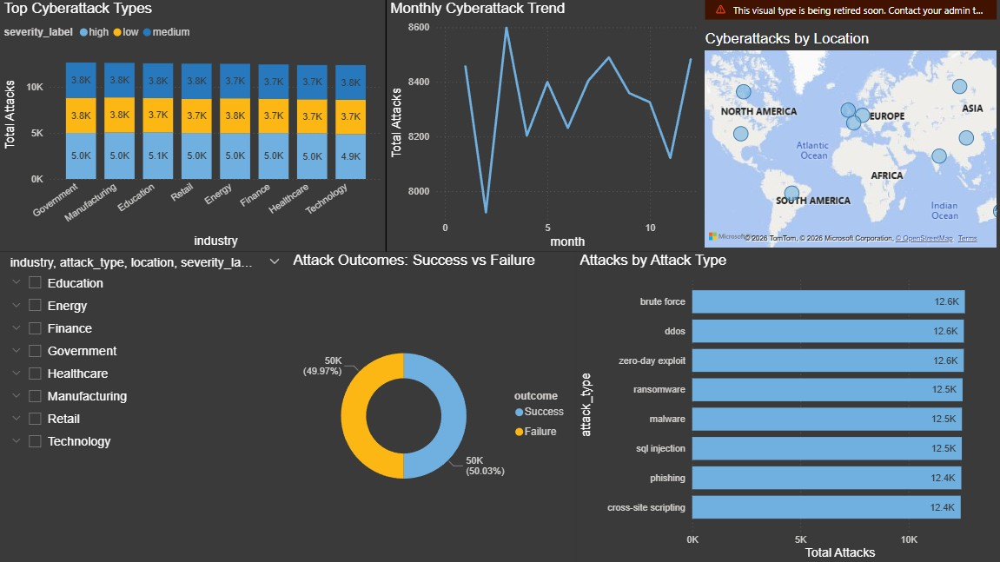

# Cyberattack-Trends-Risk-Analysis
End-to-end cybersecurity data analytics project analyzing attack trends, risk patterns, and response efficiency using Python, machine learning, and Power BI.

## 📌 Project Overview

This project analyzes cyberattack data to identify trends, high-risk patterns, and response efficiency.
Built using Python, Machine Learning, and Power BI, it focuses on turning raw security data into actionable insights.

## 🎯 Objectives
- Analyze trends in cyberattacks across industries and locations
- Identify factors contributing to high-risk attacks
- Evaluate response time and its impact on attack severity
- Build an interactive dashboard for real-time insights and decision-making

## 🛠️ Tech Stack
- Python (Pandas, NumPy, Seaborn, Matplotlib, Scikit-learn)
- Power BI (Dashboard & Data Visualization)
- Machine Learning (Random Forest Classifier)

## 📊 Dataset
- ~100,000 cyberattack records
- Includes:
  - Attack Type (Phishing, DDoS, SQL Injection, etc.)
  - Industry & Location
  - Attack Severity (1–10 scale)
  - Data Compromised (GB)
  - Response Time & Attack Duration

## ⚙️ Data Processing & Feature Engineering
## Data Cleaning
- Converted timestamps to datetime format
- Removed duplicates
- Standardized categorical values
- Handled outliers using IQR method

## Feature Engineering
- High Risk Flag → Based on severity threshold
- Attack Success Indicator → Success vs Failure
- Response Efficiency → Response Time vs Attack Duration
- Delayed Response Flag → Identifies slow incident response
- Time Features → Year, Month, Day, Hour

## 🤖 Machine Learning Approach
## Model Used:
- Random Forest Classifier

## 📉 Model Insight
After removing data leakage, model accuracy dropped to realistic levels (~60%), showing that dataset features have limited predictive power for high-risk attacks.

## 📊 Dashboard Highlights
- Attack type distribution
- Industry-wise risk analysis
- Monthly attack trends
- Geographic attack patterns

## 📌 Key Takeaway
- Understanding data and avoiding leakage is more important than achieving high accuracy.

## Preview

